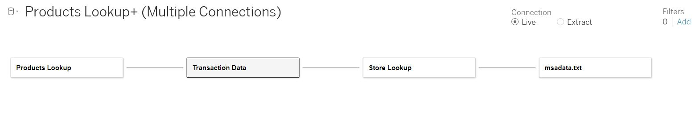
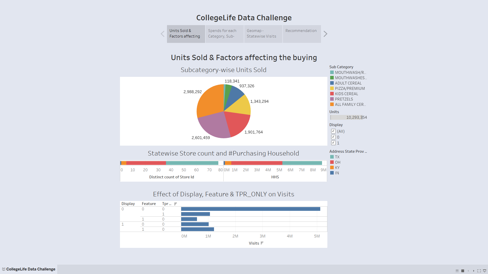
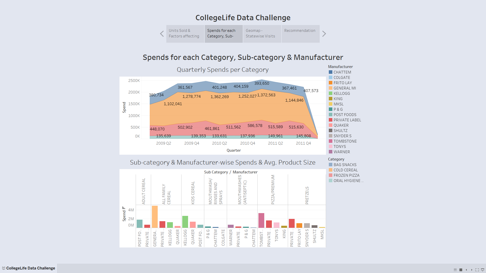
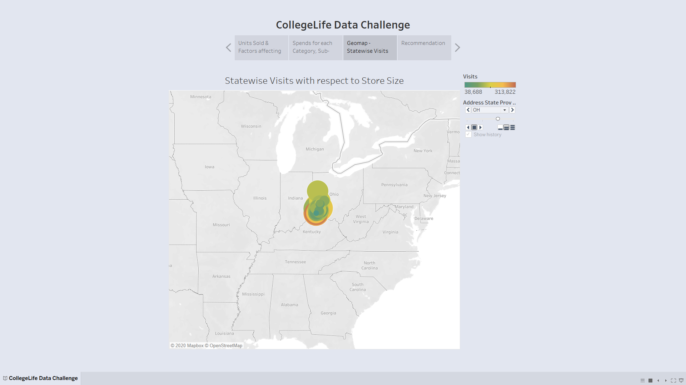

# CollegeLife-Data-Challenge---Sales-Analysis

## Introduction
This project is a replica of the Tableau Analytics and Visualization challenge conducted in 2017. The data contained in this file includes sales and promotional information from a sampling of stores over 156 weeks, beginning January 2009 through December 2011. These are the sales metrics of products in 4 categories: mouthwash, pretzels, frozen pizza, and boxed cereal, the top 5 products from each of the top 3 brands in each category. 

The workbook provides an end-to-end visualization product using a large dataset. Attached is the dataset that need to use for the implementation. The dataset is an excel workbook containing 3 worksheets where, each worksheet is a dataset. Since, all the datasets are related I used combiner and used all the datasets. We can refer to the glossary worksheet for the data set details. Also, I have taken some time to get an additional msa dataset that would help identify the locations based on the US national msa location encoding.

## Objective
- Perform exploratory data analysis.
- Analyze sales and revenue trends over the years across various demographics like categories, locations etc...
- Build visualization that would uncover any significant trends in data and Identify factors that could influence the sales and increase revenue numbers.
- Based on the visualizations and analysis provide top 3 recommendations that would enable business growth over the upcoming years and why.

The project is present in the tableau packaged workbook (workbook.twbx file) which contain one storyboard with all the visualization worksheets and dashboards formatted and labelled appropriately. The final slide of the storyboard contains recommendations for the sales business based on the EDA.

## Data Details
1] ADDRESS_CITY_NAME - city

2] ADDRESS_STATE_PROV_CODE - state

3] AVG_WEEKLY_BASKETS - average weekly baskets sold in the store

4] BASE_PRICE - base price of item

5] MANUFACTURER - manufacturer

6] CATEGORY - category of product

7] DESCRIPTION - prodcut description

8] DISPLAY - product was a part of in-store promotional display

9] FEATURE - product was in in-store circular

10] HHS - # of purchasing households

11] MSA_CODE - (Metropolitan Statistical Area) geographic region with a high core population density and close economic ties throughout the surrounding areas

12] PARKING_SPACE_QTY - number of parking spaces in the store parking lot

13] PRICE - actual amount charged for the product at shelf

14] WEEK_END_DATE - week ending date

15] SALES_AREA_SIZE_NUM - square footage of store

16] STORE_APPEAL - Retailer's designated store appeal

17] SPEND - total spend (i.e., $ sales)

18] STORE_NUM - store number

19] SUB_CATEGORY - sub-category of product

20] TPR_ONLY - temporary price reduction only (i.e., shelf tag only, product was reduced in price but not on display or in an advertisment)

21] UNITS - units sold

22] UPC - (Universal Product Code) product specific identifier

23] VISITS - number of unique purchases (baskets) that included the product

24] PRODUCT_SIZE - package size or quantity of product

## Source data combiner
The source data present in files "CollegeLife Data Challenge.xlsx" and "msadata.txt" can be combined as follows:

- Product Lookup is joined with Transactions data using UPC
- Transaction data' Store Num is joined with Store Lookup's Store ID 
- Store data is joined with msadata.txt using MSA column

## Tableau Story Screenshots

## Results
Recommendations based on the EDA are as follows:

1] Operate Stores with various offers and ample stocks for quarter Q1, since historically Q1 has witnessed a surge in spends.

2] Stores are recommended to keep enough stock of "Bag Snack" & "Cold Cereal" category.

3] Customer visits is partially dependent on the Store size, hence keep the size large enough to accomodate more customers.

4] Customers are more concerned about quality of the product despite of product being more expensive or having less quantity/volume. Hence, such high-quality sub-categories observe more sales than other sub-categories within the same category.

5] Store counts in diffferent states depend on the #purchasing household.

6] Sales does not increase with in-store promotional display, in-store circular or temporary price reduction. Hence, stores are advised not to invest much time in making such offers. 

7] Stores are advised to keep sufficient stock of "All Family Cereal", "Pretzels", and "Kids Cereal" sub-categories as they are highly popular and account for more than 70% of the units sold.

## Live Dashboard

https://prod-useast-b.online.tableau.com/t/tableauprojectgallery/views/SalesAnalysis/CollegeLifeDataChallenge?:showAppBanner=false&:display_count=n&:showVizHome=n&:origin=viz_share_link

